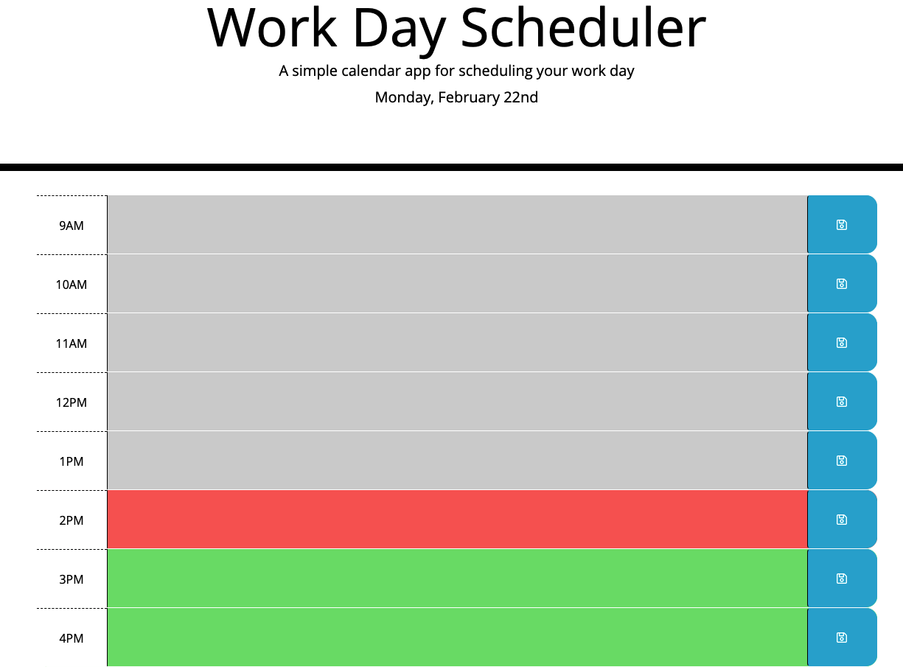

# **Work Day Scheduler(“work-day-scheduler_jQuery”)**

## Table of Contents

* [Description](#description)
* [Requirements](#requirements)
* [Installation](#installation)
* [Contributing](#contributing)
* [Credits](#credits)

## Description
---
This code was refactored using starter calendar code. The idea was to improve the app so it would run the HTML and CSS with dynamic updates from jQuery. I generated my calendar utilizing JavaScript and then attatched the classes. Functions were created using moment.js to update utilizing military time.

Deployed Website: 



## Requirements 
---
```
GIVEN I am using a daily planner to create a schedule
WHEN I open the planner
THEN the current day is displayed at the top of the calendar
WHEN I scroll down
THEN I am presented with timeblocks for standard business hours
WHEN I view the timeblocks for that day
THEN each timeblock is color coded to indicate whether it is in the past, present, or future
WHEN I click into a timeblock
THEN I can enter an event
WHEN I click the save button for that timeblock
THEN the text for that event is saved in local storage
WHEN I refresh the page
THEN the saved events persist
```

## Installation
---
No installation needed for this project

See deployed site here: https://haleighspurlock.github.io/work-day-scheduler_jQuery

See repository here: https://github.com/haleighspurlock/work-day-scheduler_jQuery
## Contributing
---

Any and all improvement suggestions are welcome! 

Email: haleighspurlock@gmail.com

## Credits
---
© 2021 Trilogy Education Services, LLC, a 2U, Inc. brand. Confidential and Proprietary. All Rights Reserved.
© 2021 FontAwesome for Icon
© 2021 Haleigh Spurlock
